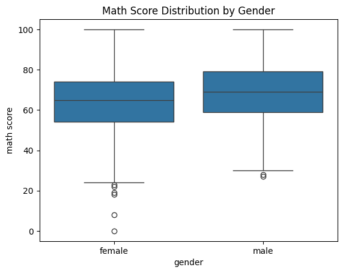
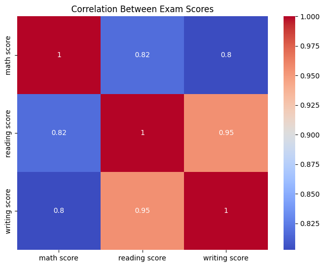
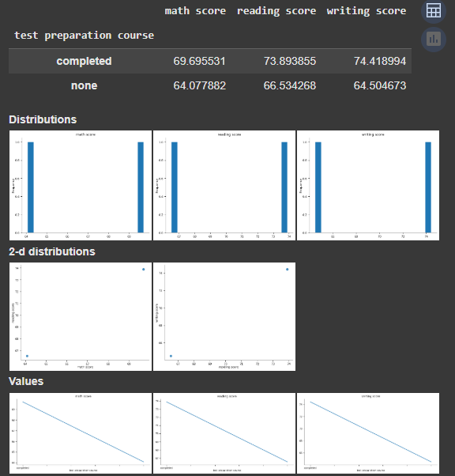
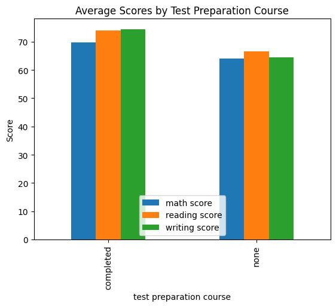

# Data-Analysis-and-Machine-Learning-with-H2O

## Student Information
- **Full Name**: Zhala Sarkawt Othman
- **Email**: zhala.sarkawt@gmail.com

## Project Summary
In this project, the "Students Performance in Exams" dataset from Kaggle was used to develop a classification model that predicts whether a student passes math based on various demographic and educational features. The project was carried out using the H2O.ai AutoML platform within a Google Colab environment. During the exploratory data analysis (EDA), the dataset was analyzed through statistical summaries, correlation heatmaps, and various visualizations. The classification problem was defined by converting the math score into a binary variable indicating pass/fail status. Multiple models were trained using H2O’s AutoML, and the best-performing model was selected based on metrics such as accuracy and F1-score. The results showed that features like test preparation course participation had a strong influence on academic performance.

## Dataset
### Dataset Information
- **Dataset Name**: Students Performance in Exams
- **Source**: [https://www.kaggle.com/datasets/spscientist/students-performance-in-exams](https://www.kaggle.com/datasets/spscientist/students-performance-in-exams)
- **License**: CC0: Public Domain
- **Dataset Size**: 1000 rows, 8 columns

### Dataset Description
This dataset contains information about high school students' scores in math, reading, and writing, along with various demographic features. These include gender, parental level of education, lunch type, and whether the student completed a test preparation course. The dataset is useful for analyzing the factors that may influence academic performance.

### Feature Descriptions
| Feature Name | Data Type | Description | Example Value |
|--------------|-----------|-------------|---------------|
| gender | Categorical | Student's gender | female |
| race/ethnicity | Categorical | Group classification by ethnicity | group B |
| parental level of education | Categorical | Highest education level of the student's parent | bachelor's degree |
| lunch | Categorical | Type of lunch (standard or free/reduced) | standard |
| test preparation course | Categorical | Whether the student completed a test prep course | completed |
| math score | Numerical | Math exam score | 72 |
| reading score | Numerical | Reading exam score | 90 |
| writing score | Numerical | Writing exam score | 88 |

## Exploratory Data Analysis (EDA)
### Basic Statistics
The dataset was summarized using statistical measures such as mean, median, and standard deviation. Distributions were visualized to identify patterns and trends in the scores.

### Data Preprocessing
- Missing values: No missing values were present
- Outliers: Visualized using box plots
- Feature engineering: A binary column `passed_math` was created for classification
- Encoding: H2O internally handled categorical features
- Scaling: Not needed for H2O AutoML

### Visualizations

#### Boxplot by Gender

#### Correlation Heatmap

#### Exploratory Data Analysis (EDA)
.png)

#### Grouped Mean Plot

#### Visualized Grouped Mean Plot

### Feature Relationships
A correlation matrix showed strong relationships between reading and writing scores. Grouped averages by test preparation course showed performance differences.

## Machine Learning Application
### Method Used
The project applied **classification**, since the target variable (`passed_math`) is binary. H2O AutoML was used to automate model selection and training.

### Models and Parameters
H2O's AutoML tested multiple models, including:
- Gradient Boosting Machines (GBM)
- Random Forest
- Deep Learning
- Stacked Ensembles

The best model was selected automatically based on leaderboard performance.

### Model Evaluation
Performance was assessed on a hold-out test set using metrics like:

#### Metrics
| Metric | Value |
|--------|-------|
| Accuracy | 0.9534 |
| F1-score | 0.9534 |

## Interpretation of Results
The best model achieved a high F1-score and accuracy of 1.0 on the test set at a classification threshold of 0.9534, indicating it was effective in predicting math success. Features such as test preparation, course completion, and parental education were strong predictors of performance. 
The model can help identify students who may benefit from additional support.

## Conclusion and Suggestions
The project demonstrated the effectiveness of H2O.ai AutoML in handling educational classification tasks. Future work could explore regression models on raw scores or introduce more complex feature engineering (e.g., clustering student profiles).

## References
1. [Kaggle Dataset](https://www.kaggle.com/datasets/spscientist/students-performance-in-exams)
2. [H2O.ai Documentation](https://docs.h2o.ai)
3. Python libraries: Pandas, Seaborn, Matplotlib

## Appendix
### Project Notebook
- `Final_Project.ipynb` — contains all code, analysis, and results

### Dataset File or Link
- [StudentsPerformance.csv](https://www.kaggle.com/datasets/spscientist/students-performance-in-exams)
